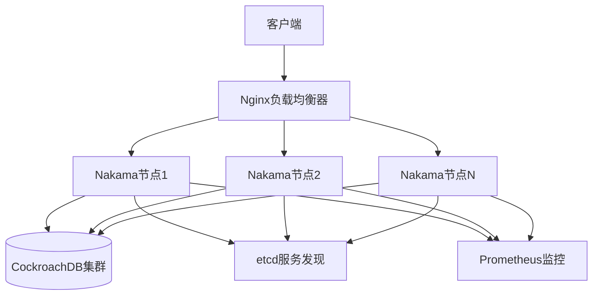

# 系统架构详解

## 整体架构概述

Nakama-plus 采用**微服务架构**，在官方Nakama基础上增强了**集群功能**和**分布式能力**。

## 架构组件图



## 核心组件功能

### 1. Nakama节点 (无状态服务)
- **功能**: 处理游戏逻辑、用户会话、实时通信
- **特点**: 可水平扩展，通过负载均衡分发请求
- **通信**: 节点间通过gossip协议同步状态

### 2. CockroachDB (有状态存储)
- **角色**: 分布式SQL数据库
- **功能**: 存储用户数据、游戏状态、匹配信息
- **特点**: 高可用、自动分片、强一致性

### 3. etcd (服务发现)
- **功能**: 节点注册发现、配置共享、领导选举
- **作用**: 实现集群的自动发现和故障转移

### 4. Nginx (负载均衡)
- **功能**: 流量分发、SSL终止、健康检查
- **策略**: 轮询、最少连接、IP哈希等

### 5. Prometheus (监控系统)
- **功能**: 指标收集、性能监控、告警通知
- **监控项**: CPU、内存、网络、请求量、错误率

## 数据流分析

### 客户端请求流程
```
1. 客户端 → Nginx (负载均衡)
2. Nginx → Nakama节点 (业务处理)
3. Nakama节点 → CockroachDB (数据持久化)
4. Nakama节点 → etcd (状态同步)
5. Nakama节点 → Prometheus (指标上报)
```

### 节点间通信流程
```
1. 新节点启动 → 向etcd注册
2. 节点健康检查 → 定期上报状态
3. 数据同步 → 通过gossip协议传播
4. 领导选举 → 通过etcd协调
```

## 集群运作模式

### 单节点模式 (开发环境)
```
客户端 → Nakama节点 → CockroachDB
                    ↘ Prometheus
```

### 多节点模式 (生产环境)
```
客户端 → Nginx → Nakama节点1 → CockroachDB集群
         ↘ Nakama节点2 → etcd集群
         ↘ Nakama节点3 → Prometheus
```

## 扩展性设计

### 水平扩展
- **Nakama节点**: 可随意增加节点数量
- **数据库**: CockroachDB自动分片扩容
- **负载均衡**: Nginx支持动态后端配置

### 容错机制
- **节点故障**: 自动从负载均衡中移除
- **数据库故障**: 多副本自动故障转移
- **网络分区**: 通过etcd检测和处理

## 性能特性

### 高并发处理
- 每个Nakama节点可处理数千并发连接
- 通过连接池优化数据库访问
- 异步非阻塞I/O模型

### 低延迟通信
- WebSocket长连接减少握手开销
- 内存缓存减少数据库访问
- 本地匹配减少网络传输

## 安全架构

### 数据传输安全
- TLS/SSL加密通信
- JWT令牌认证
- API密钥访问控制

### 数据存储安全
- 数据库连接加密
- 敏感数据加密存储
- 访问权限控制

这个架构确保了系统的高可用性、可扩展性和安全性。